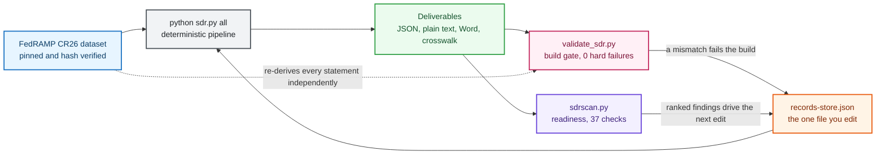

<h1 align="center">FedRAMP 20x Security Decision Record Framework</h1>

<p align="center">
  <strong>Treat your FedRAMP authorization package as code, not as a document.</strong><br>
  Generate a schema-valid, dataset-traceable Security Decision Record from one file you actually edit.
</p>

<p align="center">
  <a href="https://github.com/satishuv/FEDRAMP-20x-SDR-Documentation/actions/workflows/validate.yml"></a>
  <a href="https://github.com/satishuv/FEDRAMP-20x-SDR-Documentation/actions/workflows/drift-check.yml"></a>
  
  
  
  <a href="LICENSE"></a>
</p>

<p align="center">
  <a href="docs/getting-started.md">Get started</a> &middot;
  <a href="docs/implementation-guide.md">Fill in your facts</a> &middot;
  <a href="docs/architecture.md">Architecture</a> &middot;
  <a href="docs/vision.md">Vision</a> &middot;
  <a href="docs/glossary.md">Glossary</a>
</p>

<p align="center">
  <sub>Pinned to CR26 dataset <code>2026.07.14.01</code>. A scheduled <a href="https://github.com/satishuv/FEDRAMP-20x-SDR-Documentation/actions/workflows/drift-check.yml">drift check</a> hash-compares the pinned dataset and schemas against <a href="https://github.com/FedRAMP/rules">github.com/FedRAMP/rules</a> daily and opens an issue on any change. Green drift badge above means the pin still matches upstream.</sub>
</p>

---

> [!CAUTION]
> ## Read this before you use anything this repository produces
>
> **This is not a compliance audit bot. It does not generate compliance.**
>
> This framework is an authoring and formatting aid. It assembles a schema-valid document and scaffolds draft text. It does **not** assess, certify, or attest anything, and it **cannot** make you FedRAMP 20x compliant.
>
> - **Nothing generated here is compliant, verified, or authoritative.** Any Security Decision Record (SDR), Key Security Indicator (KSI) narrative, implementation text, validation text, evidence summary, finding explanation, or any other output — whether produced by the deterministic pipeline or by an optional AI-assist module — is an **unverified draft only**. It carries no assurance of accuracy, completeness, or correctness.
>
> - **Producing a document with this repository does not guarantee, imply, or contribute to FedRAMP 20x compliance.** Passing the build gate means the file is *well-formed*, not that the *claims in it are true*. A green build is a formatting check, never a compliance determination.
>
> - **Every single letter must be independently re-checked and verified by a qualified human before any use.** Do not submit, rely on, or represent any output of this repository as fact, as evidence, or as a compliance position until a knowledgeable person has read it end to end, confirmed every statement against the actual system and the authoritative FedRAMP sources, and taken ownership of it. Treat all generated text as a starting draft to be rewritten, not as an answer.
>
> - **AI-assisted output is especially not to be trusted as-is.** The optional AI modules draft, explain, summarize, flag, and suggest. They can be wrong, incomplete, or misleading, and they may state things the underlying facts do not support. They never gather evidence, never set an implementation status, and never write an assessment — those remain human decisions with human sign-off. AI output is a suggestion for a human to verify, nothing more.
>
> - **Compliance is determined only by an accredited independent assessor and the authorizing body — never by this tool.** No software, and nothing in this repository, can grant, promise, or substitute for a real FedRAMP 20x authorization.
>
> - **No warranty. Use entirely at your own risk.** This software is provided "as is," without warranty of any kind. The authors and rights holders accept no liability for any use, misuse, or reliance on it or on anything it produces.
>
> **Ownership and rights.** This work is associated with and developed in the context of **Amazon Web Services (AWS) Security Assurance Services (SAS)**. AWS Security Assurance Services and its affiliates reserve all rights in and to this work to the fullest extent applicable. All AWS-related names, marks, and materials remain the property of Amazon Web Services, Inc. and its affiliates. Use of this repository does not transfer any such rights, and nothing here should be read as an official AWS position, product, or service. FedRAMP requirement text and schemas remain the property of their respective owners (see [License and rights](#license-and-rights)).

---

## The problem

FedRAMP 20x asks providers for a Security Decision Record (SDR) that is machine-readable, schema-valid, and backed by automated verification. Two rules drive this: `FRC-CSX-VVK` calls for automated methods to persistently verify and validate each Key Security Indicator, with the obligation rising by class (`MAY` at A, `SHOULD` at B, `MUST` at C and D), and `FRC-CSX-VVR` asks for the same across the SDR itself.

A hand-maintained Word document cannot satisfy that. It drifts from the requirement text the moment FedRAMP updates the dataset, it cannot be diffed, and it gives an assessor no way to trace a sentence back to the rule that demanded it.

## The approach

This framework makes the SDR a build artifact with exactly two inputs.



Two inputs, one pipeline, two checkers with different jobs, and a loop that tells you what to write next.

Requirement text is never typed by hand. It is resolved from the canonical FedRAMP Consolidated Rules for 2026 (CR26) dataset, and an independent validator re-derives every statement from that dataset and fails the build on any mismatch. You write facts about your system. The framework writes everything else.

## Quickstart

```bash
git clone https://github.com/satishuv/FEDRAMP-20x-SDR-Documentation.git
cd FEDRAMP-20x-SDR-Documentation
pip install jsonschema referencing python-docx

python sdr.py all
```

That builds every deliverable, runs the validator, and prints a readiness summary. Expect `hard failures: 0` and a long list of open items: the repository ships as a template with honest placeholders, so open items are the correct result on a fresh clone.

Then open `sdr/records/records-store.json` and start replacing `TBD` with facts about your system. That file is the only one you edit. See the [implementation guide](docs/implementation-guide.md).

If you have GNU make, `make all` wraps the same command. To run the seven build steps individually, see [getting started](docs/getting-started.md).

## What you get

| Deliverable | Path | Purpose |
|---|---|---|
| Official SDR JSON | `sdr/json/sdr-class-*.json` | Validates against the FedRAMP SDR schema with zero errors |
| Provider extensions | `sdr/json/sdr-class-*-extensions.json` | Your extra fields, isolated so the official file stays clean |
| Plain-text SDR | `sdr/human-readable/sdr-class-*.txt` | The human-readable half that `CDS-CSO-CBF` requires to stay in sync |
| Authoring Word file | `sdr/human-readable/sdr-class-*-authoring.docx` | For reviewers who need to comment in Word |
| Rev5 crosswalk | `traceability/rev5-to-20x-crosswalk.csv` | Maps NIST SP 800-53 Revision 5 controls to 20x indicators |
| Validation report | `validation/reports/validation-report.json` | Eight checks, one exit code, gates the build |
| Readiness findings | `validation/reports/sdrscan/` | One finding per rule and per indicator, severity-ranked |

## Scope today

| Class | Rules resolved | Indicators | Automated methods per indicator | State |
|---|---|---|---|---|
| A | 41 | 7 mandatory | 0 required | Supported |
| B | 158 | 46 | at least 1 | Supported |
| C | 158 plus overlay | 46 | at least 2 | Supported |
| D | 157 | 46 | at least 4 | Readiness register only. FedRAMP lists the Class D path for 2027 |

`FRD-CCL` describes the classes as assurance categories "increasing from minimal assurance at Class A to significant assurance at Class D." The dataset does not map them to the Low, Moderate, and High impact levels, so neither does this framework.

Derived from the CR26 dataset at version `2026.07.14.01`: 234 rules in 20x scope out of 246 total entries, the remaining 12 being rev5-only, plus 46 Key Security Indicators across 10 families.

## What this is not

Being direct about this matters more than adoption numbers. See the [caution banner](#read-this-before-you-use-anything-this-repository-produces) at the top for the full statement; in short:

- Not a compliance claim, and not a compliance generator. Every status ships as `Not Implemented` or `TBD`. Nothing here asserts that anyone meets a requirement, and no output of the pipeline or the AI modules is compliant or verified.
- Not a shortcut past assessment. It produces a defensible draft record; an accredited independent assessor still does the assessing. A green build is a formatting check, not a compliance determination.
- Not trustworthy without human verification. Every generated statement — deterministic or AI-assisted — is an unverified draft. Every letter must be re-checked and confirmed by a qualified human before any use.
- Not a place for customer data. No account identifiers, credentials, endpoints, or restricted report content, ever. Per-customer work belongs in a separate private repository. The validator actively scans for leaked secrets and fails on a hit.
- Not affiliated with or endorsed by FedRAMP. FedRAMP publishes the rules; this repository consumes them. Nothing here is an official AWS position, product, or service.

## Documentation

| Guide | Read it when |
|---|---|
| [Getting started](docs/getting-started.md) | You want a validated SDR on your machine in five minutes |
| [Implementation guide](docs/implementation-guide.md) | You are filling in your own facts and need to know what each field wants |
| [Architecture](docs/architecture.md) | You want to know why the pipeline is shaped this way |
| [Certification classes](docs/certification-classes.md) | You are deciding between Class A, B, C, or planning for D |
| [Validation and readiness](docs/validation.md) | You want to understand the build gate and the readiness scanner |
| [Continuous integration](docs/ci-cd.md) | You are wiring this into GitHub Actions or AWS CodePipeline |
| [Automation layers](docs/automation.md) | You want evidence collected from a live account rather than typed |
| [Glossary](docs/glossary.md) | An acronym is in your way |
| [Frequently asked questions](docs/faq.md) | Something surprised you |
| [Vision and mission](docs/vision.md) | You want to know where this is going and what it refuses to do |

## Contributing

Corrections to requirement interpretation are the most valuable contributions, and they are held to a hard standard: cite the rule identifier and quote its statement from the dataset. See [CONTRIBUTING.md](CONTRIBUTING.md). Security reports go through [SECURITY.md](SECURITY.md), not public issues.

## License and rights

All rights reserved. See [LICENSE](LICENSE). This is not open-source software; no license or permission to use, copy, modify, or distribute is granted without prior express written permission of Amazon Web Services, Inc.

This work is associated with **Amazon Web Services (AWS) Security Assurance Services (SAS)**. AWS Security Assurance Services and its affiliates reserve all rights in and to this work to the fullest extent applicable, and all AWS names, marks, and materials remain the property of Amazon Web Services, Inc. and its affiliates. Nothing here is an official AWS position, product, service, or endorsement.

FedRAMP requirement text and schemas are published by the United States General Services Administration at [github.com/FedRAMP/rules](https://github.com/FedRAMP/rules) and are reproduced here under their terms as government works.
