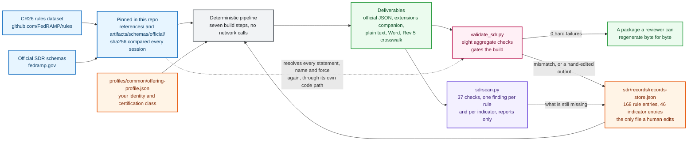
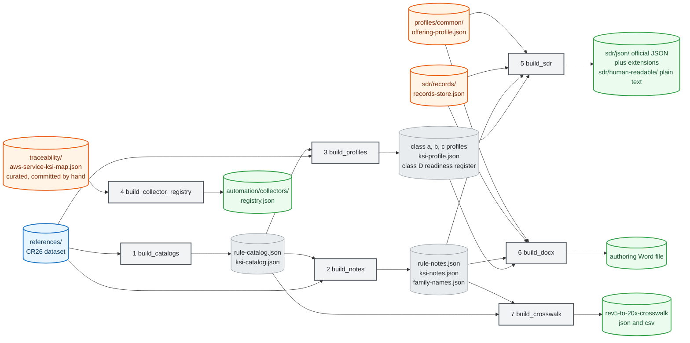
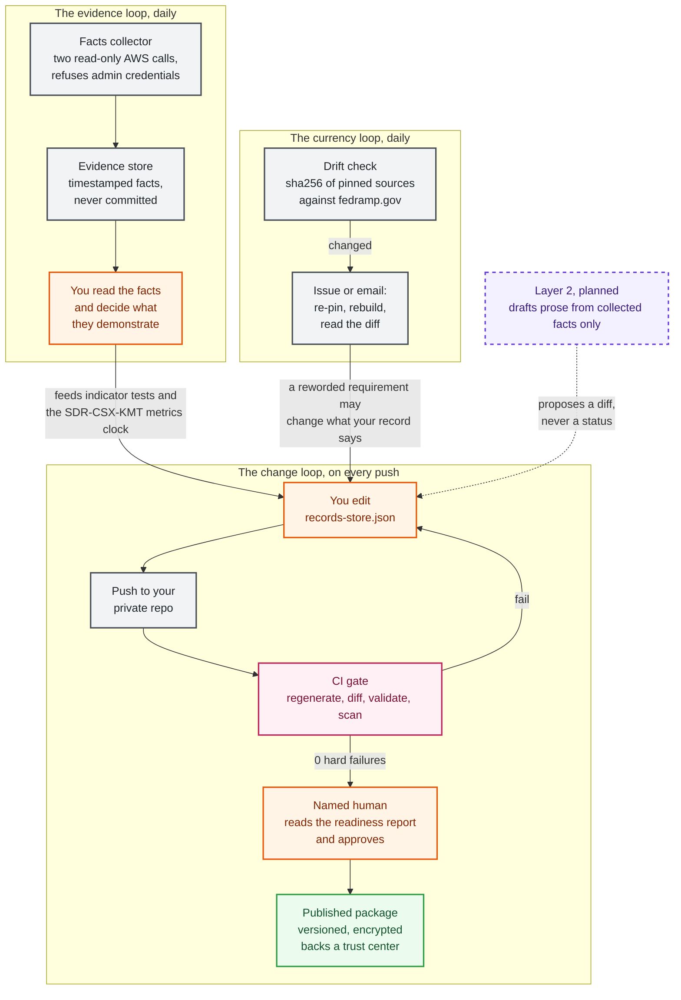

# Architecture

Two views: how a record gets built, and how it runs day to day.

## Document build flow

The shape of it first, then the exact dependencies.



Two inputs, one pipeline, two checkers with different jobs. The pinned dataset supplies every requirement statement, force level, family name, and class variant. The record store supplies your facts. Nothing else feeds a deliverable.

The dotted edge is the one worth staring at. The gate does not read what the pipeline produced and assume it is right; it goes back to the pinned dataset and derives the same answer independently.

Now the exact dependencies. Cylinders are files, rectangles are scripts, and the numbers are the order continuous integration runs them in:



Two things the arrows tell you that a numbered list hides. Step 4 depends on nothing upstream of it, only on the curated service map, so it can run at any point. Step 6 does not wait for step 5: the Word file is built from the same profiles, notes, and record store as the JSON rather than from the JSON, which is why `CDS-CSO-CBF` format consistency has to be checked rather than assumed.

`traceability/aws-service-ksi-map.json` is the one file in `traceability/` that is curated rather than generated. Everything else in that directory is a build output.

## Operational pipeline

Three loops run at different speeds: a change loop on every push, a daily evidence loop, and a daily currency loop watching FedRAMP itself.



Notice where the humans sit. Approval before publication, judgment between a collected fact and a written claim. Automation runs every edge that does not require a decision, and no edge that does.

## Why it is shaped this way

**Requirement text is resolved, never transcribed.** `build_catalogs.py` extracts every rule and indicator from the pinned dataset. If FedRAMP rewords a statement, the next build picks it up and the diff shows exactly what moved. Nobody retypes anything, so nobody introduces a subtle paraphrase that an assessor later reads differently than the rule intends.

**The validator does not trust the builders.** `validate_sdr.py` re-derives every statement, name, force level, and family expansion from the dataset through its own resolution path, then compares against what the builders produced. A bug in a builder cannot pass validation just because the validator shares its assumptions. This is the check that makes the traceability claim real rather than aspirational.

**One editable surface, enforced.** Continuous integration regenerates everything and fails if any generated file differs from what the pipeline produces. That converts "please do not hand-edit the outputs" from a convention into a build error.

**Determinism, deliberately.** Generated JSON, text, and CSV carry no run timestamps and are byte-identical across runs of unchanged inputs, verified by double-run hash comparison. Anyone can regenerate your package and confirm it matches what you shipped. Word files are the exception: their zip container embeds file-entry timestamps, so bytes differ while content is identical.

**Paths are relative.** Every script resolves paths from its own location, so the repository works from any checkout directory and in any continuous integration environment.

## The traversal problem, and why it is called out everywhere

The CR26 dataset nests rules five levels deep:

```
ds["FRR"][family]["data"][applicability][subset][rule_id]
```

`applicability` is one of `all`, `20x`, or `rev5`. An index built only from `data["all"]` silently drops every 20x-only rule, which is all of the `*-CSX-*` identifiers, including `FRC-CSX-VVK` and `FRC-CSX-VVR`, the two rules that motivate this entire framework. The failure mode is nasty: real rule identifiers appear fabricated, and a reviewer confidently reports a correct citation as an error.

The other three sections each use a different shape:

| Section | Shape | Count |
|---|---|---|
| `FRR` | `[family]["data"][applicability][subset][id]` | 246 entries; 234 in 20x scope, 12 rev5-only |
| `KSI` | `[family]["indicators"][id]`, no applicability layer | 46 indicators in 10 families |
| `CTL` | `[family][control-id]`, no applicability layer, holds `guidance` rather than `statement` | 79 entries in 14 control families |
| `FRD` | `["data"]["all"][id]`, keyed on `term` and `definition` | 75 definitions |

One resolver will not serve all four. FedRAMP documents this in its own `AGENTS.md`, and the repository mirrors that file so automated sessions read it before doing structural work.

## Repository layout

| Path | Contents |
|---|---|
| `references/` | Pinned CR26 dataset, hash-compared against upstream |
| `artifacts/schemas/official/` | Pinned official FedRAMP SDR and common-definitions schemas |
| `sdr/records/` | The single editable record store |
| `sdr/json/` | Generated official JSON plus extensions companion, per class |
| `sdr/human-readable/` | Generated plain text and authoring Word file, per class |
| `profiles/` | Per-class rule profiles, the common indicator profile, the offering profile, the Class D readiness register |
| `traceability/` | Derived catalogs, notes, family names, the Revision 5 crosswalk, the AWS service to indicator map |
| `validation/scripts/` | The pipeline and the validator |
| `validation/reports/` | Generated validation results, including per-indicator test results |
| `automation/collectors/` | Read-only facts collector and its registry |
| `automation/sdrscan/` | The readiness scanner |
| `automation/pipeline/` | Deployable AWS CodePipeline reference |
| `docs/` | This documentation |
| `.claude/` | Guardrails for automated agent sessions working in this repository |

`steering/` and `quality/` are local working notes, excluded by `.gitignore` because session logs carry engagement context.

## Design decisions worth questioning

Honest list of places where a reasonable person would choose differently.

**One giant record store.** A single JSON file with 214 entries is unwieldy in an editor and merges badly when two people work at once. Splitting per family would ease that at the cost of the single-editable-surface guarantee that everything else rests on. If concurrent authoring becomes the norm, this is the first thing to revisit.

**JSON rather than YAML for the record store.** YAML would be friendlier for long prose. JSON was chosen because the deliverable is JSON and the schema is JSON, so the authoring format matching the output format removes a translation layer where errors hide.

**Word output at all.** It exists because reviewers ask for it. It is also the one deliverable that cannot be byte-stable, which slightly weakens the reproducibility story.

**Python with three dependencies.** Deliberately boring, so a provider's security team can read the whole pipeline in an afternoon.

See [validation](validation.md) for what gets checked and [automation](automation.md) for the collector layers.
