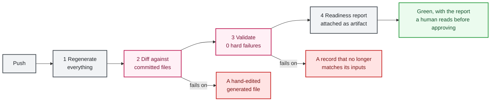

# Continuous integration

Two interchangeable implementations ship here, enforcing the same gates. Pick whichever fits your environment. The security comes from the gates, not from the vendor.

## The four gates

Whichever you run, this is what must happen on every change:

1. **Regenerate everything** from the pinned dataset and the record store.
2. **Fail on any hand-edited output.** Regenerate, then diff. If a generated file differs from what the pipeline produces, the build fails. This turns "do not edit generated files" from a convention into an error.
3. **Validate with zero hard failures.**
4. **Attach a readiness report** so a human approver can read it before signing.



Gate 2 is the one people leave out, and it is the one that keeps the whole traceability claim honest. Without it, someone edits the JSON directly under deadline pressure and the record silently stops matching its inputs.

## GitHub Actions

No AWS account needed. Free-tier friendly.

| Workflow | Trigger | What it does |
|---|---|---|
| `.github/workflows/validate.yml` | push, pull request | Runs the four gates, refuses a stale scanner check catalog, attaches the readiness report as a build artifact |
| `.github/workflows/drift-check.yml` | daily schedule | Hash-compares pinned FedRAMP sources against upstream, opens an issue on drift |

Actions are pinned to full commit SHAs rather than tags, so a compromised or retagged upstream action cannot change what runs in your pipeline. Keep it that way when you add steps.

## Local security gate (ASH and Fortify)

Security scanning does not run in the external repo's CI. Both scanners are local pre-merge gates you run before committing to `main`, and again on a fresh local copy of `main` after a merge:

| Scanner | Command | What it covers |
|---|---|---|
| ASH (AWS Automated Security Helper) | `scripts/ash_scan.sh` or `.\scripts\ash_scan.ps1` | Bandit, checkov, detect-secrets, cdk-nag. Scope and suppressions in `.ash.yaml` |
| Fortify SCA | `scripts/fortify_scan.sh` or `.\scripts\fortify_scan.ps1` | Deeper dataflow and structural analysis. Suppressions in `.fortify/sdr-filter.txt` |

Install the pre-push hook once per clone (`.\scripts\install-fortify-hook.ps1`) and both run automatically on a push to `main`. Feature-branch pushes are not gated. See [scripts/README-fortify.md](../scripts/README-fortify.md) for install and override details. Emergency bypass: `git push --no-verify`.

## AWS CodePipeline

Use this when the provider wants approval, publication, evidence storage, and scheduled collection inside their own AWS environment. `automation/pipeline/` holds a deployable reference, modeled on the AWS DevSecOps pipeline pattern but with SDR-specific gates in place of the usual composition, static, and dynamic analysis scanners.

| Stage | What happens | Rule it supports |
|---|---|---|
| Source | A push to your private SDR repository via AWS CodeConnections triggers the pipeline | `CMT` change management practices |
| Validate and package | CodeBuild regenerates every deliverable, fails on any hand-edited file, then runs the validator requiring zero hard failures | `FRC-CSX-VVR` persistent automated verification and validation |
| Readiness scan | The scanner writes per-rule and per-indicator findings into the build artifact. Reports, does not gate | `CDS-CSO-CBF`, `FRC-CSX-VVR` |
| Human approval | Amazon SNS emails an approver, who can read the readiness report before signing. Nothing publishes without sign-off | Human-gated statuses |
| Publish | Deliverables land in a versioned, encrypted Amazon S3 bucket that can back a trust center or package delivery | `FRC-CSO-JSN`, `SDR-CSO-MTD` |
| Daily drift check | Hash-compares pinned sources against fedramp.gov and alerts on change | Source currency |
| Daily collector, opt-in | Runs the read-only facts collector into an evidence bucket | `SDR-CSX-KMT` metrics, `FRC-CSX-MOT` persistent validation |

### Deploying

Create and authorize the CodeConnections connection to your git host once in the console first, then:

```bash
aws cloudformation deploy \
  --template-file automation/pipeline/sdr-pipeline.yaml \
  --stack-name sdr-pipeline \
  --capabilities CAPABILITY_IAM \
  --parameter-overrides \
    ConnectionArn=arn:aws:codeconnections:REGION:ACCOUNT:connection/ID \
    FullRepositoryId=your-org/your-sdr-repo \
    NotificationEmail=approver@example.com
```

The template avoids hardcoded partitions, so it works in standard and AWS GovCloud regions. AWS CodeCommit is not used because it is closed to new customers; the source is any git host CodeConnections supports.

Buildspecs live alongside the template: `buildspec-validate.yml`, `buildspec-drift-check.yml`, `buildspec-collect.yml`.

## Running against your own record

Fork or clone, then point your pipeline at your private repository. Do not open pull requests against this repository containing your real record.

One thing to get right before your first push: confirm the secret scan is running. `no_sensitive_patterns` checks every deliverable for account identifiers, access keys, and private keys. It is part of the validator, so it runs in gate 3, but verify it fires in your environment rather than assuming it.

See [validation](validation.md) for what each gate checks, and [automation](automation.md) for the collector the scheduled stage runs.
