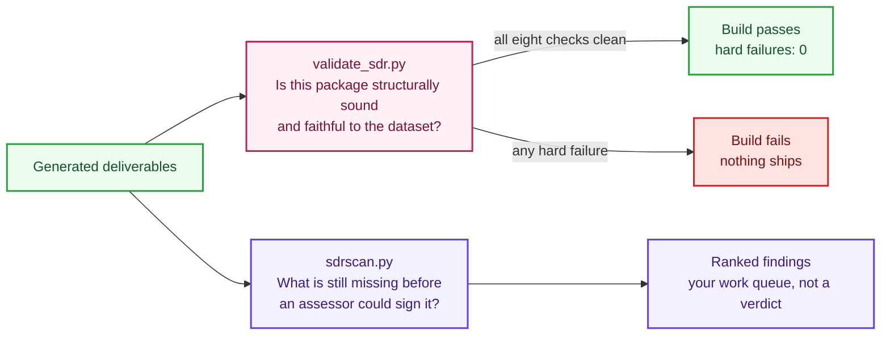

# Validation and readiness

The repository checks the record twice, for two different questions. They are not redundant, and confusing them is the most common misreading of the output.



The gate can pass while the scanner reports two thousand findings, and on a fresh clone it does exactly that. A structurally perfect record with honest `TBD`s everywhere is shippable as a build and nowhere near assessable, and the tools are separated so those two statements can both be true at once.

| | `validate_sdr.py` | `sdrscan.py` |
|---|---|---|
| Question | Is this package structurally sound and faithful to the dataset? | What is still missing before an assessor could sign it? |
| Output | 8 aggregate checks, one exit code | One finding per resource per check, severity-ranked |
| Gates the build | Yes. Zero hard failures required | No. Reports only |
| On a fresh template | Passes, with one expected soft failure | Thousands of findings, which is correct |
| Supports | `FRC-CSO-JSN` schema conformance, `CDS-CSO-CBF` format consistency | `FRC-CSX-VVR` persistent verification, `CDS-CSO-CBF` |

## The build gate

```bash
python sdr.py validate
```

Eight checks, in order:

| Check | What it does | Failure means |
|---|---|---|
| `official_schema_validation` | Validates generated JSON against the pinned official FedRAMP SDR schema | The deliverable would be rejected. Zero errors required |
| `rule_coverage` | Compares rules present against the class profile, both directions | A rule is missing, or one appears that does not belong to the class |
| `ksi_coverage` | All 46 indicators present for classes B and up | An indicator was dropped |
| `ksi_required_fields` | Every indicator carries the six schema-required fields | A field the schema demands is absent |
| `ksi_test_minimums` | Automated methods per indicator against the `FRC-CSX-VVK` minimum for the class | See the soft failure note below |
| `no_markdown_in_human_readable` | Deliverable text is clean plain text, no markdown symbols | Formatting leaked into a document meant to be read as text |
| `no_sensitive_patterns` | Scans all deliverables for account identifiers, access keys, private keys | Something that must never be committed is in a deliverable |
| `content_fidelity_against_dataset` | Re-derives every statement, name, force, and family expansion from the dataset and compares | Either a builder is wrong, or a generated file was hand-edited |

The line that gates the build is `hard failures: 0`.

### The one expected failure

On a fresh clone you will see:

```
FAIL: ksi_test_minimums | 43 KSIs below the FRC-CSX-VVK minimum for class B
```

This is correct. `FRC-CSX-VVK` requires automated validation methods per indicator, and a template has none yet. It is classified as a soft failure during authoring so it does not block you from building while you work, and it becomes a hard failure at release. If it were a hard failure from the start, nobody could run the pipeline on a fresh clone, and the usual response would be to disable the check, which is worse.

### Why content fidelity matters most

`content_fidelity_against_dataset` is the check that makes the traceability claim real. The validator does not read what the builders produced and assume it is right. It independently resolves every rule from the pinned dataset through its own code path, then compares. A bug in `build_sdr.py` cannot slip through by sharing an assumption with the validator, because the validator does not share the builders' code.

It is also how the repository enforces "never hand-edit generated files." If you edit `sdr/json/sdr-class-c.json` directly, this check fails on the next run. Regenerate instead: `python sdr.py build`.

## The readiness scanner

```bash
python automation/sdrscan/sdrscan.py --only-fails
```

37 checks producing one finding per rule and per indicator. Each finding carries the check that fired, the resource, the severity, the FedRAMP rule that makes it a requirement, and the exact JSON path to fix. The model is deliberately close to Prowler's: findings, not a score.

Useful invocations:

```bash
# Triage: the findings that matter most
python automation/sdrscan/sdrscan.py --only-fails --severity critical,high

# Indicators only
python automation/sdrscan/sdrscan.py --only-fails --resource-type KSI

# One check, while you clear it
python automation/sdrscan/sdrscan.py --check ksi_test_minimum_met --only-fails

# What checks exist
python automation/sdrscan/sdrscan.py --list-checks

# Machine-readable for a dashboard
python automation/sdrscan/sdrscan.py --output-formats json,csv
```

Output formats are `json`, `csv`, `html`, `txt`, and `none`. Reports land in `validation/reports/sdrscan/` and are git-excluded because they are build outputs.

Reports carry no run timestamp by default so repeated scans of unchanged inputs are byte-identical. Add `--timestamp` when you want the real run time recorded, for example when attaching a report to an assessment package.

### Thousands of findings is the correct answer

Against the shipped template the scanner reports thousands of failures. That is not a bug, and it is not softened. A template has genuinely open gaps, and a tool that reported green on an empty record would be worse than no tool. The scanner drives the filling-in work; it does not gate the build.

Full check reference: [automation/sdrscan/README.md](../automation/sdrscan/README.md).

### Keeping the catalog in step

The check registry is mirrored in `automation/sdrscan/check-catalog.json`, and continuous integration refuses a stale one. After changing `checks.py`:

```bash
python automation/sdrscan/sdrscan.py --write-catalog
```

## Determinism

Generated JSON, text, and CSV are byte-identical across runs of unchanged inputs, verified by double-run hash comparison. No run timestamps are embedded anywhere. This lets a reviewer regenerate your package and confirm it matches what you shipped, which is a stronger claim than asking them to trust the file.

Word files are the exception. Their zip container embeds file-entry timestamps, so bytes differ between runs while content is identical.

To record when your content actually changed, set `sdr_last_updated` in `profiles/common/offering-profile.json`. It is manual on purpose, so that a rebuild does not falsely claim your record was updated today.

## Upstream drift

FedRAMP updates schema files in place without renaming them, so a pinned copy can silently go stale. Two mechanisms catch it.

The scheduled drift check hash-compares the pinned dataset and both official schemas against the live copies daily, and opens an issue on any change. In this repository it runs as `.github/workflows/drift-check.yml`; the AWS reference implements the same thing on an EventBridge schedule.

For automated agent sessions, a SessionStart hook reads the dataset, both schemas, the dataset's own JSON schema, FedRAMP's `AGENTS.md`, and the published rules page at the start of every session, and reports whether the pinned copies still match.

When drift is reported: re-pin the changed source, rebuild everything, and read the diff. A wording change in a requirement statement can change what your record needs to say, so this is a review step rather than a mechanical update.

## Continuous integration

Both implementations enforce the same four gates: regenerate everything, fail on any hand-edited output, validate with zero hard failures, attach a readiness report. See [continuous integration](ci-cd.md).
